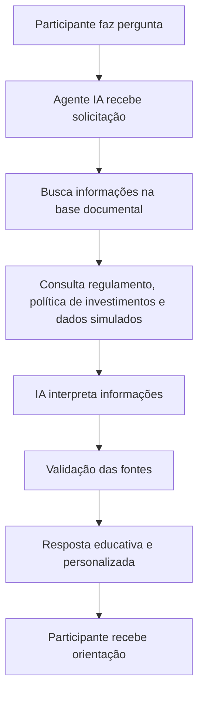

# Documentação do Agente

## Caso de Uso

### Problema
> Qual problema financeiro seu agente resolve?

Participantes de planos de contribuição variável frequentemente não compreendem:
-	o próprio perfil de risco;
-	as oscilações de rentabilidade;
-	os impactos do cenário econômico;
-	as diferenças entre perfis de investimento;
-	os efeitos das decisões emocionais;
-	o planejamento previdenciário de longo prazo.
Como consequência:
-	fazem escolhas inadequadas;
-	mudam de perfil em momentos de crise;
-	não acompanham a evolução do plano;
-	possuem baixa educação financeira e previdenciária.

### Solução
> Como o agente resolve esse problema de forma proativa?

Criar um agente com IA generativa capaz de oferecer:
-	educação financeira personalizada;
-	explicações simplificadas sobre previdência;
-	interpretação de rentabilidade e cenários;
-	apoio à tomada de decisão consciente;
-	acompanhamento contínuo do participante.

### Público-Alvo
> Quem vai usar esse agente?

Participantes do plano PREV:
-	ativos;
-	autopatrocinados;
-	participantes próximos da aposentadoria;
-	usuários com baixo conhecimento financeiro.

---

## Persona e Tom de Voz

### Nome do Agente
PrevInteligente

### Personalidade
> Como o agente se comporta? (ex: consultivo, direto, educativo)

O agente atua como um educador previdenciário digital, com linguagem acolhedora, didática e objetiva, ajudando o participante a compreender melhor seu plano de previdência e tomar decisões mais conscientes.

### Tom de Comunicação
> Formal, informal, técnico, acessível?

Deve ser
-	claro;
-	humano;
-	explicativo;
-	respeitoso;
-	acessível.
Deve evitar
-	promessas;
-	alarmismo;
-	excesso de jargão;
-	recomendações definitivas.

### Exemplos de Linguagem

- Saudação: "Olá! Posso ajudar você a entender melhor seu plano PREV e seus perfis de investimento."
- Confirmação:  "Entendi! Deixa eu verificar isso para você."
- Erro/Limitação: "Não encontrei essa informação nos documentos disponíveis do plano. Recomendo consultar a entidade administradora."

---

## Arquitetura

### Diagrama

### Componentes
Componentes principais:
Base documental
-	regulamento PREV;
-	política de investimentos;
-	documentos públicos da EFPC;
-	perguntas frequentes;
-	dados simulados de participantes.

| Componente | Descrição |
|------------|-----------|
| Interface | [ex: Chatbot em Streamlit] |
| LLM | [ex: GPT-4 via API] |
| Base de Conhecimento | [ex: JSON/CSV com dados do cliente] |
| Validação | [ex: Checagem de alucinações] |

---
## Motor de IA Generativa
Responsável por:
-	interpretar perguntas;
-	gerar respostas contextualizadas;
-	simplificar termos técnicos;
-	produzir orientações educativas.

 

## Segurança e Anti-Alucinação
   ### Camada de Segurança
      Responsável por:
      -	limitar respostas ao conteúdo autorizado;
      -	evitar recomendações inadequadas;
      -	informar limitações do agente.
   ### Estratégias Adotadas

Estratégias Anti-Alucinação
O agente:
-	responde apenas com base nos documentos fornecidos;
-	utiliza RAG (Retrieval-Augmented Generation);
-	cita a fonte utilizada na resposta;
-	informa quando não possui dados suficientes e redireciona;
-	evita inferências não documentadas.

### Limitações Declaradas do Agente
> O que o agente NÃO faz?

O agente **NÃO**:
-	prevê mercado;
-	garante rentabilidade;
-	faz recomendação financeira individual;
-	substitui especialistas humanos;
-	acessa dados reais de participantes;
-	executa operações financeiras.
